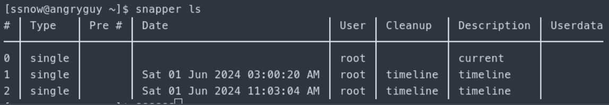
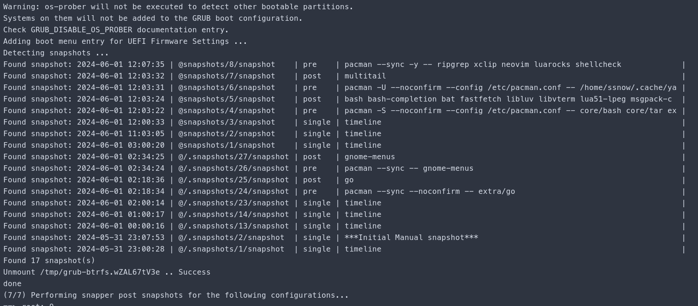

# BTRFS Snapper

This is currently a work in progress!!!!!

This project is not finish and still in development use at your own RISK!!!


## Boot Arch ISO
Using the arch live iso

## System Description
BTRFS, Snapper, btrfs-grub, snap-pac

Snapper is a tool for managing BTRFS snapshots. It can create and restore snapshots, and provides scheduled auto-snapping. Snap-pac provides a Pacman hook that uses Snapper to create pre- and post- BTRFS snapshots triggered by use of the package manager.

Snapshots can be created manualy or whit the Timeline scheduler.
it will also prune the timeline and install snapshot automaticaly when 
they reach the posted threshold that you set in the config.

which  can be found:

```
/etc/snapper/configs/root
```
# Installing and cofiguring snapper/grub

1. Install the OS of choice:
2. Create the Additional Subvolumes
3. Install and Configure Snapper
4. Intstall and Configure Grub-Btrfs
5. Create a system Root Snapshot and set tit as default
6. Test Snapper 
7. Enable automatic Timeline Snapshots


## install grub-btrfs
```
sudo systemctl enable --now grub-btrfsd
sudo grub-mkconfig -o /boot/grub/grub.cfg
```
WARNING: 'grub-mkconfig' needs to run at least once to generate the snapshots (sub)menu entry in grub the main menu. After that this script can run alone to generate the snapshot entries.
```
sudo btrfs property get  /.snapshots/1/snapshot
## or ( sudo btrfs prop get -ts / )
sudo btrfs property set /.snapshots /1/snapshot ro false
```
1-  =  the snapshot that is currently booted in.

## Check which subvol/snapshot is the default ID#
```
sudo btrfs subvol get-defualt /

sudo btrfs subvol list /
```
## Set the Default so grub can see the snapshot ID# to boot
```
btrfs subvolume set-default 263 /
```
As you can see, the /.snapshots/1/snapshot subvolume is also visible as snapshot #1 in snapper. The asterisk (*) indicates that this snapshot is the default and is currently active.

----------------------------------------------------------------------------
## Useful Commands
```
snapper list-configs
snapper delete-config
snapper get-config
snapper list

snapper -c root create -d "***Initial Manual snapshot***"

btrfs subvolume delete /.snapshots/1/snapshot
btrfs subvolume delete /.snapshots

sudo btrfs subvolume list /
sudo btrfs subvolume show /

snapper status 2..3
sudo snapper undochange 2..3
sudo snapper undochange 3..2
```
## To see the difference of a file to compare snapshot 3 to 0
```
snapper diff 3..0 /etc/hosts
sudo snapper undochange 3..0 /etc/hosts
```
## Create Manual Pre-Post Snapshots and Undo the Changes
```
snapper -c root create -t pre -c number -d 'Pre Color Picker'
```
## After install and makin changes 
```
snapper -c root create -t post --pre-number 4 -c number -d 'Post Color Picker'
```
```
snapper -c root delete 4-7
snapper -c home delete 1-2

sudo snapper rollback
sudo reboot
sudo grub2-mkconfig -o /boot/grub2/grub.cfg

sudo btrfs filesystem du -s --human-readable /.snapshots/*/snapshot

snapper delete 1
snapper delete 3-4
```
----------------------------------------------------------------------------
# Make a Snapshot the New System Root
Providing there is no snapshot/1
Create a directory named /.snapshots/1 
```
sudo mkdir -v /.snapshots/1
```
## Copy the info.xml file from /.snapshots/2/ to /.snapshots/1/.
```
sudo cp -v /.snapshots/2/info.xml /.snapshots/1/
```
## Edit the info.xml
```
<?xml version="1.0"?>
<snapshot>
  <type>single</type>
  <num>1</num>
  <date>2024-04-26 15:18:14</date>
  <description>new root subvolume</description>
</snapshot>
```
## Create a read-write subvolume snapshot of snapshot #2 in the /.snapshots/1/ directory.
```
sudo btrfs subvolume snapshot /.snapshots/2/snapshot /.snapshots/1/snapshot
```
## Get the subvolid of the /.snapshots/1/snapshot subvolume.
```
sudo btrfs inspect-internal rootid /.snapshots/1/snapshot
```
Output:
#> 276

## Using subvolid 276, set the /.snapshots/1/snapshot subvolume as the default subvolume for the root (/) 						
## filesystem.
```
sudo btrfs subvolume set-default 276 /
```
## Then reboot.
```
sudo reboot
```
## After rebooting, confirm that the /.snapshots/1/snapshot subvolume is indeed the default for the / 
## filesystem.
```
sudo btrfs subvolume get-default /
```
## And is writable.
```
sudo btrfs property get -ts /
```
## Take a look at the snapper now.
```
snapper ls
```
## As you can see, snapshot #1 is the default. You can now delete the remaining snapshots.

## Update grub.cfg file
```
sudo grub2-mkconfig -o /boot/grub2/grub.cfg
```

# Enable Automatic Timeline Snapshots
```
sudo snapper -c home set-config TIMELINE_CREATE=no
sudo systemctl enable --now snapper-timeline.timer
sudo systemctl enable --now snapper-cleanup.timer
```

```
echo 'PRUNENAMES = ".snapshots"' | sudo tee -a /etc/updatedb.conf
```

## sync up grub
paru -S update-grub
sudo update-grub

# There are a couple of packages used for automatically creating snapshots upon a pacman transaction:

- snap-pac — Makes pacman automatically use snapper to create pre/post snapshots like openSUSE's YaST. Uses pacman hooks.
- grub-btrfs — Includes a daemon (grub-btrfsd) that can be enabled via systemctl to look for new snapshots and automatically includes them in the GRUB menu.


## System rollback the 'Arch Way'
Snapper includes a rollback tool, but on Arch systems the preferred method is a manual rollback.

After booting into a snapshot mounted rw courtesy of overlayfs, mount the toplevel subvolume (subvolid=5). That is, omit any subvolid or subvol mount flags (example: an encrypted device map labelled cryptdev) ...
```
sudo mount /dev/mapper/cryptdev /mnt
```
Move the broken @ subvolume out of the way ...

```
sudo mv /mnt/@ /mnt/@.broken
```
Or simply delete the subvolume ...
```
sudo btrfs subvolume delete /mnt/@
```
Find the number of the snapshot that you want to recover ...
```
sudo grep -r '<date>' /mnt/@snapshots/*/info.xml
[...]
/.snapshots/8/info.xml:  <date>2022-08-20 15:21:53</date>
/.snapshots/9/info.xml:  <date>2022-08-20 15:22:39</date>
```
Create a read-write snapshot of the read-only snapshot taken by Snapper ...
```
sudo btrfs subvolume snapshot /mnt/@snapshots/number/snapshot /mnt/@
```
Where number is the snapshot you wish to restore as the new @.

Unmount /mnt.

Reboot and rollback!


## Other things to consider 
```
inotify-tools  ?? Do I need this
snap-pac-grub
btrfs-asssitant
```

More information can be found in the arch wiki:
```
https://wiki.archlinux.org/title/snapper
```





## Grub boot screen picture


Reference info:
1. https://www.lorenzobettini.it/2022/07/timeshift-and-grub-btrfs-in-linux-arch/
2. https://wiki.archlinux.org/title/Btrfs
3. https://www.youtube.com/watch?v=aAAUU3t55YQ
4. https://www.lorenzobettini.it/2023/03/snapper-and-grub-btrfs-in-arch-linux/
5. https://www.dwarmstrong.org/archlinux-install/
6. https://www.dwarmstrong.org/btrfs-snapshots-rollbacks/


